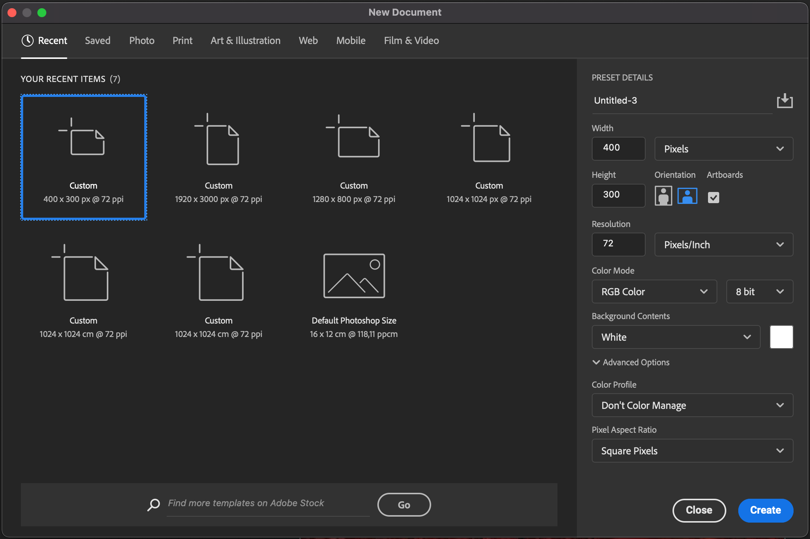
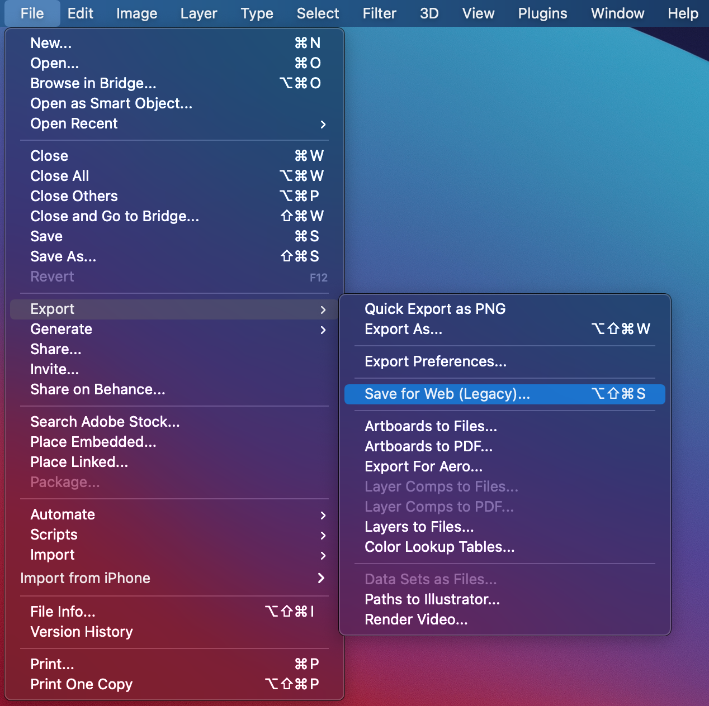
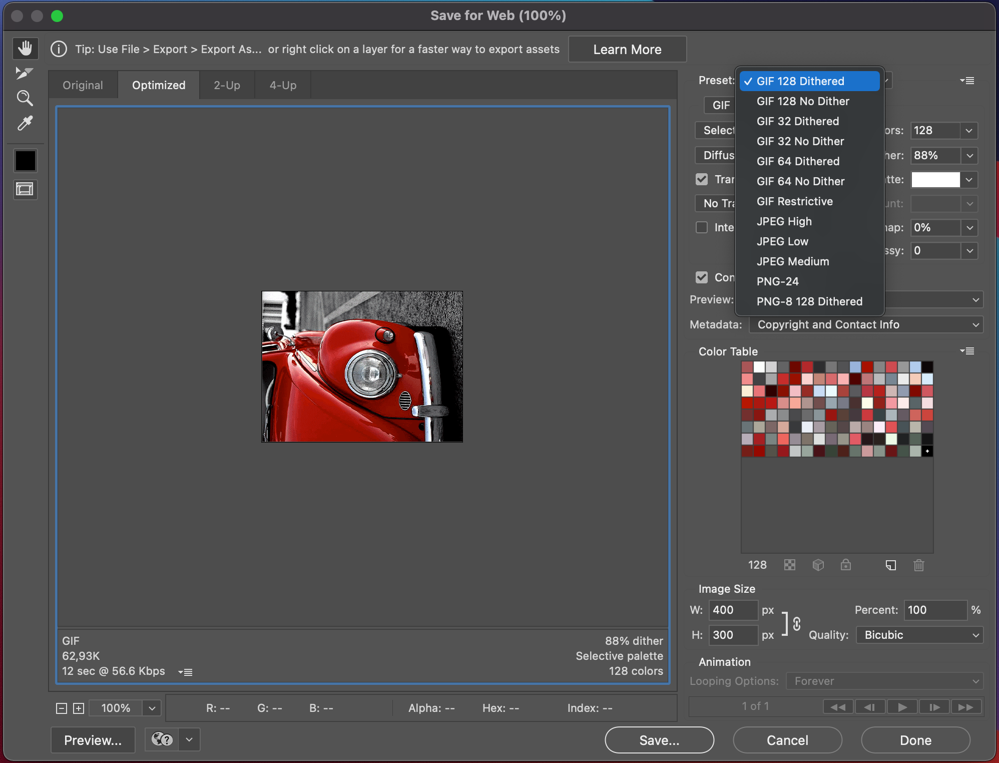
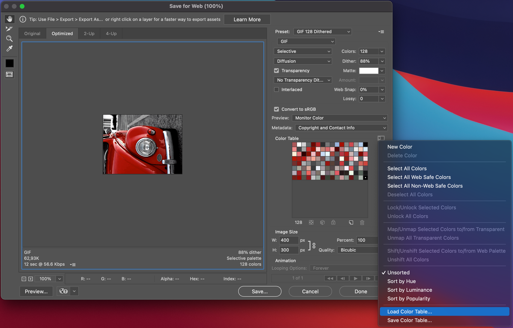
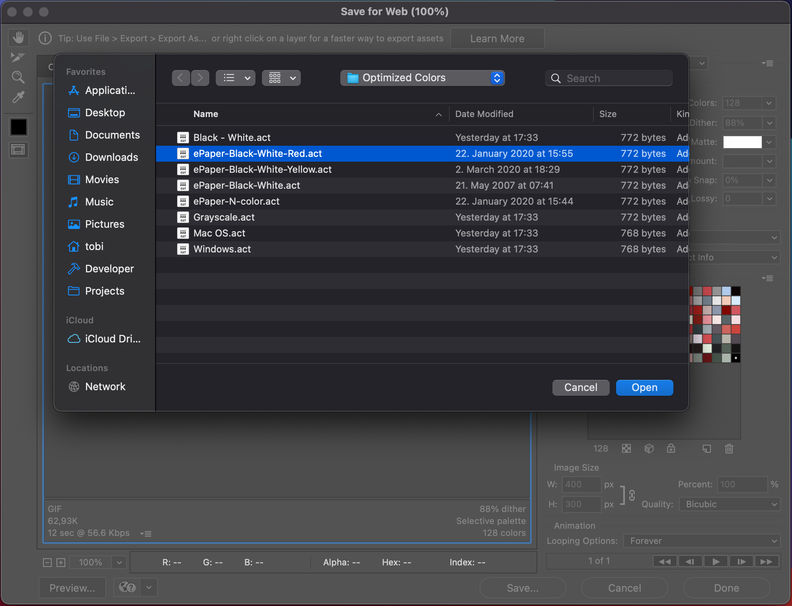
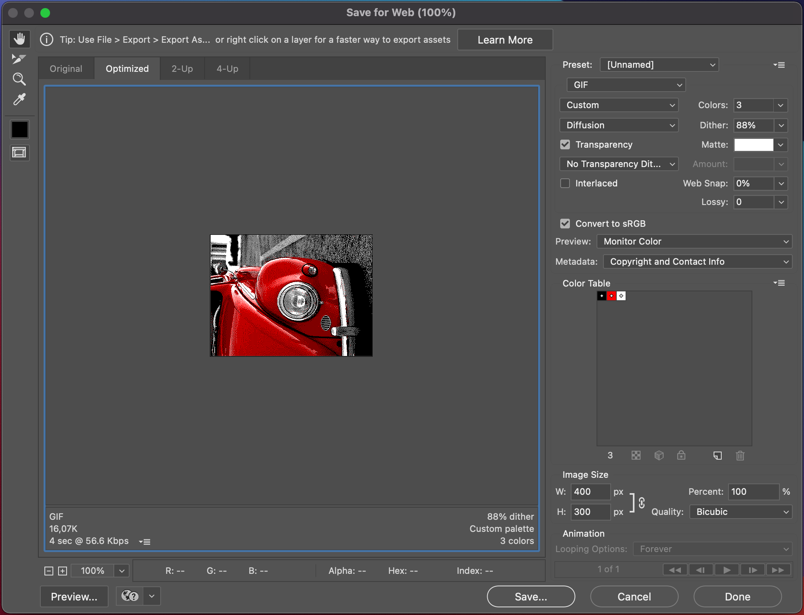

# Convert GIF to binary

## Apply color palette using Photoshop

### 1. Create document
Create document with the exact resolution of the screen.


### 2. Save for Web (Legacy)


### 3. Select preset
Select `GIF 128 Dithered` preset.


### 4. Load color palette


### 5. Select color palette
The palette files can be found in the `palettes/` folder.


### 6. Save image
Save the image into the `input/` folder.


### 7. Convert image
Convert image using this command:
```bash
./convert.py input/[filename].gif
```

### 8. Copy byte array into Arduino project
Copy the `output.c` files content into the Arduino project and upload it to ESP32 (see `examples/` folder).

### 9. Connect screen to ESP32

ePaper | ESP32
------ | -----
VCC    | 3.3V
GND    | GND
DIN    | 14
CLK    | 13
CS     | 15
DC     | 27
RST    | 26
BUSY   | 25

### Sources
[Make BMP file for e-Paper](https://www.waveshare.com/wiki/E-Paper_Floyd-Steinberg)